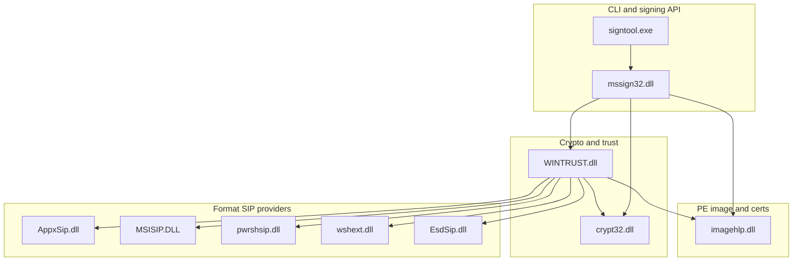

# Windows Authenticode: signing binaries and SIP modules

This is a **reference map** of the main Windows executables and DLLs involved in **`signtool.exe`**-style Authenticode signing and verification. The **`psign`** project is a **port** of that behavior: it calls the same public Win32 APIs and follows the same subject-interface package (SIP) contracts as the native toolchain, with optional portable digest checks in Rust for parity.

**Local-only outputs** (manifests, parity JSON, optional copies of system DLLs) live under **`parity-output/`**, which is **gitignored**—see the root **`.gitignore`**.

## Relationship overview



**WINTRUST** routes a subject file to the correct **CryptSIP** implementation (by file type / GUID), orchestrates **PKCS#7** / **Authenticode** verification, and uses **catalog** and policy logic. **mssign32** implements **SignerSignEx3** and related APIs used for signing and timestamping. **imagehlp** supplies the PE **Authenticode image digest** stream and **WIN_CERTIFICATE** / certificate table operations. **crypt32** provides **CryptMsg***, **Cert***, and related primitives.

## Executables (short list)

| Module | Role |
|--------|------|
| **signtool.exe** | Windows SDK CLI for sign, verify, timestamp, remove, catdb, etc. Primary behavioral reference for this port. Installed with the Windows SDK under **Windows Kits\10\bin** (versioned subfolders such as **x64**, **x86**, **arm64**). |
| **psign** | Rust port (this repo): Windows build uses **SignerSignEx3** / **WinVerifyTrust** / OS SIPs; digest helpers mirror inbox SIP hashing where implemented in **`psign-sip-digest`**. |

## Core DLLs (always in the picture)

| Module | Role |
|--------|------|
| **mssign32.dll** | Signing entry points (**SignerSignEx3**, **SignerTimeStampEx3**, …); bridges callers to CSP/KSP and SIP providers. |
| **crypt32.dll** | Message encoding (**CryptMsg***), certificate stores, OID decoding—central to PKCS#7 and chain handling. |
| **WINTRUST.dll** | **WinVerifyTrust**, **CryptSIPGetSignedDataMsg** / **CryptSIPPutSignedDataMsg** dispatch, catalog integration, trust policy. |
| **imagehlp.dll** | **ImageGetDigestStream** (PE Authenticode digest ranges), **ImageEnumerateCertificates** / **ImageRemoveCertificate** / … for embedded signatures. |

## Subject Interface Package (SIP) DLLs — formats

These DLLs implement **CryptSIPDll*** exports for specific **Authenticode** subject types. **WINTRUST** loads them by registration (file extension / SIP GUID), not by hard-coded filename alone.

| Module | Typical subjects | Role (one line) |
|--------|------------------|-----------------|
| **AppxSip.dll** | MSIX/Appx family (flat **.msix** / **.appx**, bundles, encrypted siblings, …) | Cleartext OPC/ZIP packaging SIP for standard packages: indirect data, PKCS#7 placement; COM helpers for manifest identity vs signer (**VerifySigningSubjectName**). Related exports cover bundles and encrypted variants. |
| **MSISIP.DLL** | **.msi** | OLE structured-storage digest (**DigestStorageMetadataHelper** / **DigestStorageContentHelper**), MSI PKCS#7 stream read/write, installer policy hooks (**DisableSizeVerification**, **DisableLegacyVerification**). |
| **pwrshsip.dll** | **.ps1**, **.psm1**, **.psd1**, … | PowerShell script SIP: UTF-16 line hashing with `#` / XML / MOF signature block markers. |
| **wshext.dll** | **.js**, **.vbs**, **.wsf**, … | WSH script SIP: marker stripping + **HashFile**-style payload hashing (UTF-16 LE). |
| **EsdSip.dll** | **.wim**, **.esd** | WIM header prefix hash + trailing PKCS#7 layout (**GetHashDataOffset** semantics). |
| **mso.dll** (often Office path) | Office macros | Delegates macro Authenticode hashing to **VBE7.DLL** (**DllVbeGetHashOfCodeProjectEx**, …)—not reimplemented in-tree. |

**CAB** (**.cab**) and **catalog** (**.cat**) Authenticode paths are handled through **WINTRUST**’s inbox routing (**no separate “CabSip.dll”** on typical installs): CAB SIP logic lives with **WINTRUST** / related inbox code; catalogs use **CryptCAT** APIs alongside PKCS#7 **CTL/SignedData**.

**Standalone .p7x** / **P7xSip*** exports appear in **AppxSip.dll** as a thin verification stub over inner PKCS#7.

## Portable parity modules (Rust)

Rough alignment between inbox SIP and **`psign-sip-digest`** / **`--rust-sip`** checks:

| Native focus | Rust module / flag |
|--------------|-------------------|
| PE / WinMD image digest | **`pe_digest`**, **`--rust-sip pe`** |
| CAB | **`cab_digest`**, **`--rust-sip cab`** |
| MSI | **`msi_digest`**, **`--rust-sip msi`** |
| ESD/WIM | **`esd_digest`**, **`--rust-sip esd`** |
| Cleartext MSIX/APPX ZIP | **`msix_digest`**, **`--rust-sip msix`** |
| PowerShell scripts | **`ps_script`** (under **`--rust-sip script`**) |
| WSH scripts | **`wsh_script`** (under **`--rust-sip script`**) |
| Catalog PKCS#7 self-consistency | **`catalog_digest`**, **`--rust-sip catalog`** |

Encrypted MSIX (**EappxSip***), third-party **ExtensionsSip** DLL chains, and full **VBA** macro SIP remain **out of scope** for portable Rust parity unless separately specified—see [`rust-sip-gaps.md`](rust-sip-gaps.md).

## Behavioral notes (documented elsewhere)

- **MSIX signing** requires **APPX_SIP_CLIENT_DATA** / non-null **pClientData** for **AppxSip**—see [`rust-sip-spec-refs.md`](rust-sip-spec-refs.md) (**SignerSignEx3** section).
- **PE page hashes** (**`/ph`**, **SPC_INC_PE_PAGE_HASHES_FLAG**, **`WintrustSetDefaultIncludePEPageHashes`**) — same doc.
- **MSI policies** under **`HKLM\Software\Policies\Microsoft\Windows\Installer`** affect native verification only; portable **`msi_digest`** does not read them—[`rust-sip-gaps.md`](rust-sip-gaps.md).

## Optional local copies

To stash amd64 (and optionally WOW64) copies of inbox binaries next to your workspace—for comparison with **`parity-output/binary-manifest.json`** or offline inspection—run:

```powershell
./scripts/copy-windows-signing-binaries.ps1
./scripts/copy-windows-signing-binaries.ps1 -IncludeCrypt32
```

Output directory: **`parity-output/vendor-binaries/`** (WOW64 modules under **`parity-output/vendor-binaries/syswow64/`**). The folder is gitignored.
